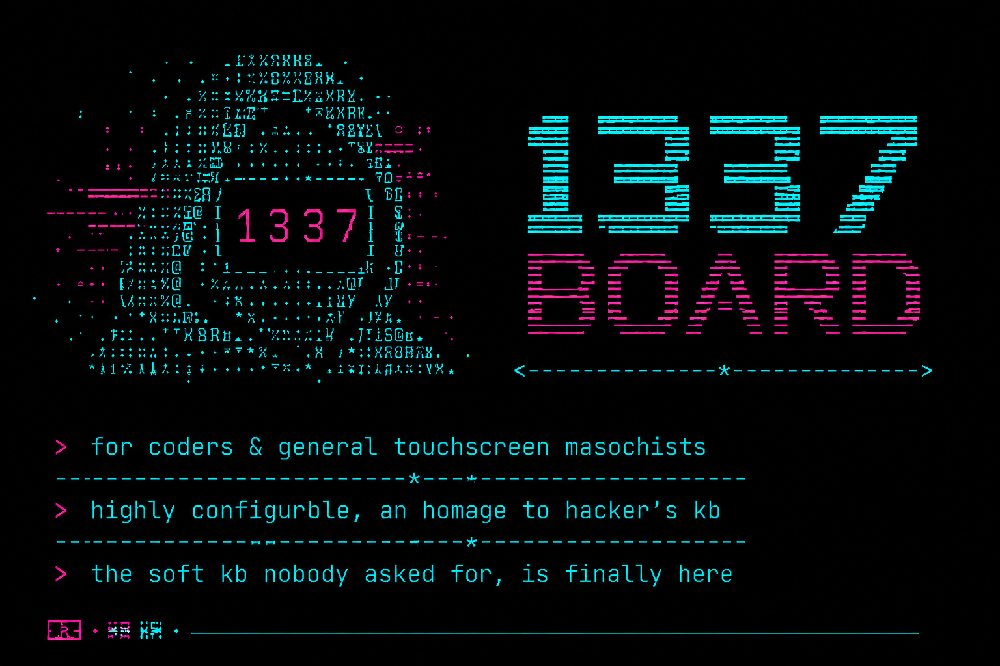
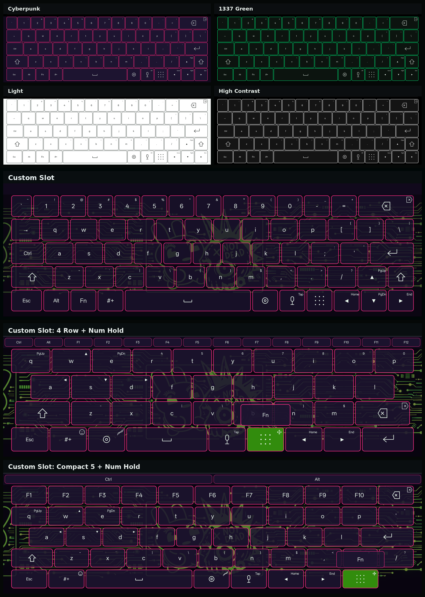
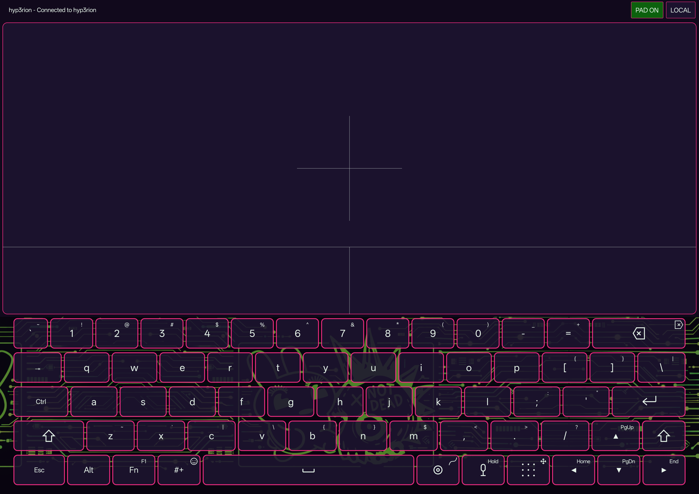
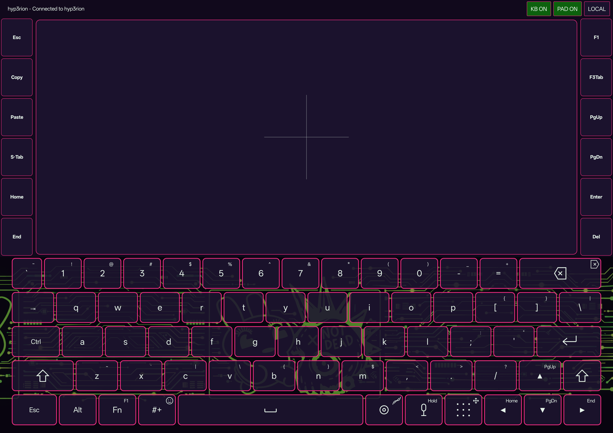
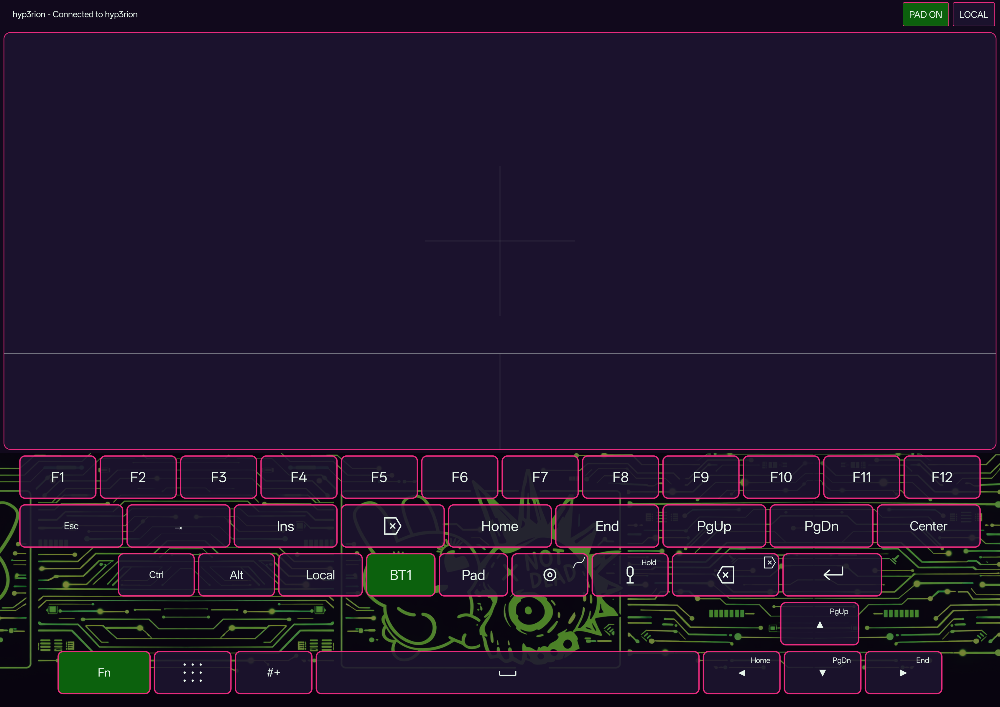
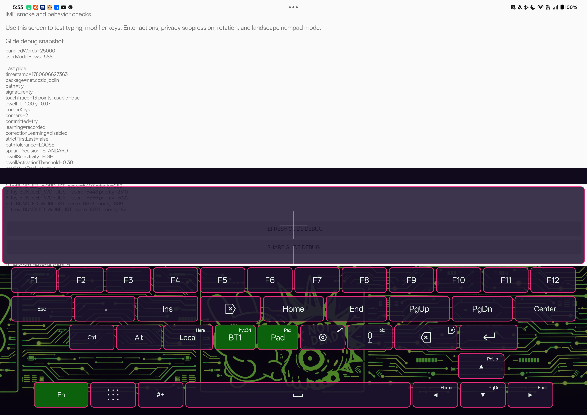

# 1337 Board



1337 Board is a desktop-style Android keyboard for terminals, editors, tablets, and power-user text entry. It is inspired by the practical layout ideas in Hacker's Keyboard, but implemented as a modern Android IME with current APIs, custom rendering, and privacy-focused defaults.

## Acknowledgement

"IT'S DANGEROUS TO GO ALONE! TAKE THIS."

1337 Board is built with deep respect for [Hacker's Keyboard](https://github.com/klausw/hackerskeyboard), the original Android power-user keyboard by Klaus Weidner. Many of us used it from the early Android days, and this project is inspired by the practical layout and terminal-friendly ideas that proved so useful for a hacker or developer on the go.

## Highlights

- Five-row PC-style QWERTY layout with number row, Esc, Tab, Ctrl, Alt, Shift, Enter, Backspace, Delete, and arrow keys.
- Phone, compact, full five-row, Fn, symbol, and numpad-oriented layouts, with separate portrait and landscape layout choices.
- Num-hold quick overlays expose Fn/navigation layers from four-row, compact five-row, and full five-row layouts.
- Four-row and compact five-row bottom controls can use right-hand `Num-Mic-Space` or left-hand `Space-Mic-Num` order.
- Configurable optional keys, preset action slots, key labels/icons, sticky modifiers, and key preview behavior.
- Local glide typing with a bundled word list, ranked suggestions, optional imported word lists, private on-device prediction, and tunable accuracy controls for path tolerance, spatial precision, and dwell sensitivity.
- Mic input through Android speech recognition, with offline preference requested when supported by the device recognizer.
- Bluetooth remote mode can send keyboard, speech, and touchpad input to assigned paired hosts, with Fn-layer target keys and pinned full-screen trackpad shortcuts.
- Full-screen Bluetooth trackpad mode supports optional left/right macro key stacks with custom labels and single-key, combo, text, or multi-step actions.
- Theme presets and a custom theme slot including light, dark, alternate dark, cyberpunk, terminal, high contrast, 1337 green-on-black, background images, and transparency controls.
- Separate portrait and landscape controls for keyboard height, margins, gaps, borders, radius, label styling, and long-press timing.



## Privacy

1337 Board is designed to avoid broad data access. The base app does not request network or contacts permissions. Preferences, customizations, imported glide words, local prediction data, and learned glide corrections stay local to the device. Microphone permission is requested only when mic input is enabled.

Glide prediction is offline. The app stores accepted words, local word pairs, and optional correction learning in app-private storage, and settings include controls to review corrections and reset glide learning.

## Glide Typing

Glide typing is fully local and can be tuned from settings. Path tolerance controls how much off-key travel is allowed, spatial precision controls how strongly the traced shape and endpoints affect ranking, and dwell sensitivity lets deliberate pauses over interior letters influence candidate selection. Use diagnostics to review the last glide path, candidate scores, dwell keys, and corner keys when tuning a device.

## Glide Dictionary Setup

Glide typing is off on a fresh install. Enable it from 1337 Board Settings, then use the bundled English dictionary or import a plain text wordlist from the Glide Dictionary settings. Imported words stay in app-private storage and can be cleared to return to the bundled dictionary.

## Speech Input Setup

Mic input is off on a fresh install. The current release uses Android's system speech recognizer; the APK does not bundle a recognizer or speech model. To test speech input like the OnePlus Pad3 setup, enable or install a device speech recognizer, download offline language data if that recognizer supports it, enable Mic input in 1337 Board Settings, grant microphone permission when prompted, then test in a normal editable text field.

Recognizer availability and offline behavior vary by ROM, OEM, and installed speech package. A future privacy-first speech path is planned around optional local model packs.

## Bluetooth Remote And Trackpad

Bluetooth remote mode lets the Android device act as a local Bluetooth HID keyboard and trackpad for an assigned paired host. Assign BT1-BT3 hotkey slots in 1337 Board Settings, then use the Fn layer to switch between Local Android input, assigned Bluetooth targets, and the trackpad toggle. Only assigned target slots are shown on the keyboard.

The full-screen trackpad keeps the user-selected portrait or landscape keyboard height and fills the remaining screen with a touchpad surface. Settings include trackpad placement, height, pointer and scroll sensitivity, tap-to-click, keep-screen-on behavior, and dim-when-inactive behavior. Each assigned Bluetooth target can also request a pinned home-screen shortcut for direct full-screen trackpad access.









Detailed setup, screenshots, and troubleshooting are in [docs/bluetooth-remote.md](docs/bluetooth-remote.md).

## Release Channels

GitHub APK releases are the current distribution target. F-Droid packaging is planned after metadata, licensing, and reproducible-build checks. Google Play distribution is possible later, but not planned for this release.

Release artifacts may include three different APK types:

- Debug preview APKs are installable test builds and are not production signing identities.
- Unsigned release APKs are produced by local builds and GitHub Actions for review/reproducibility checks, but must be signed before installation.
- Production-signed APKs are the installable release artifacts once the project release key is established.

Production signing setup is documented in [docs/release-signing.md](docs/release-signing.md). The current production signing certificate SHA-256 fingerprint is `A5:18:84:47:1E:D8:40:B1:AE:48:76:12:09:F7:C2:7B:0A:5A:15:1A:67:9F:57:BE:13:A7:7E:C2:21:71:1B:F6`. Users who installed a debug-key preview may need to uninstall it before installing the first production-signed APK.

## Licensing

1337 Board is distributed under the Apache License 2.0. Bundled third-party assets and reference projects are documented in [THIRD_PARTY_NOTICES.md](THIRD_PARTY_NOTICES.md).

## Status

This project is an active prototype. Core keyboard entry, terminal keys, layout customization, themes, glide typing, speech input, Bluetooth remote mode, full-screen trackpad mode, and settings are available for testing, but the app should still be treated as pre-release software.

## Build And Install

Requirements:

- Android Studio or Android SDK command-line tools
- JDK 17
- USB debugging enabled for device testing

Build a debug APK:

```sh
./gradlew assembleDebug
```

Install on a connected device:

```sh
adb install -r app/build/outputs/apk/debug/app-debug.apk
```

Run unit tests:

```sh
./gradlew testDebugUnitTest
```

Build release artifacts:

```sh
VERSION="$(sed -nE 's/^[[:space:]]*versionName = "([^"]+)".*/\1/p' app/build.gradle.kts | head -n 1)"
scripts/build-release.sh "v$VERSION"
```

After installing, open 1337 Board, open input settings, enable the IME, then choose it from the keyboard picker.

## Project Direction

The near-term goal is a reliable, customizable Android keyboard for shell, code, remote access, Bluetooth HID control, and tablet workflows. Planned follow-up work includes stronger local speech packs, expanded layout packs, richer language support, improved autocorrect, and deeper non-alphanumeric key placement controls.
