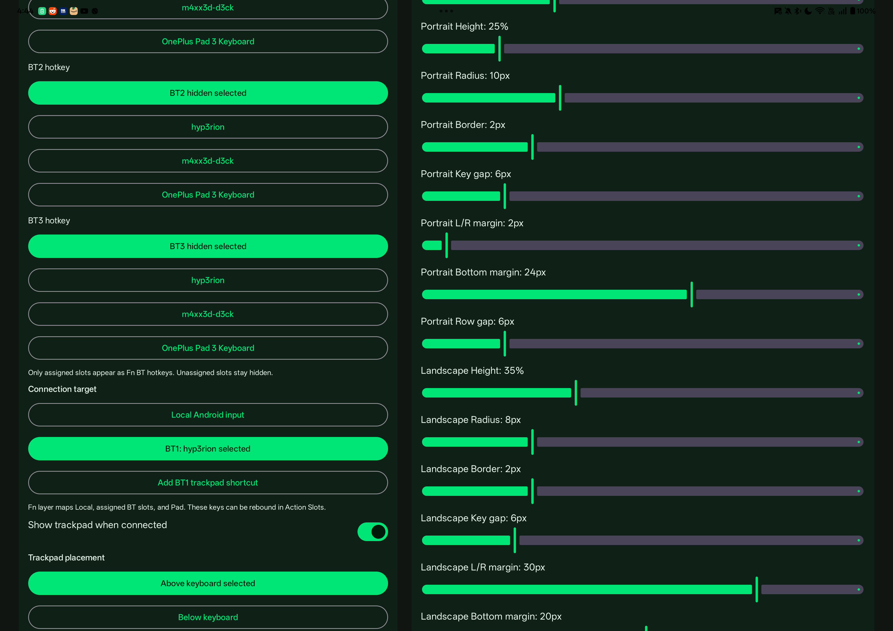
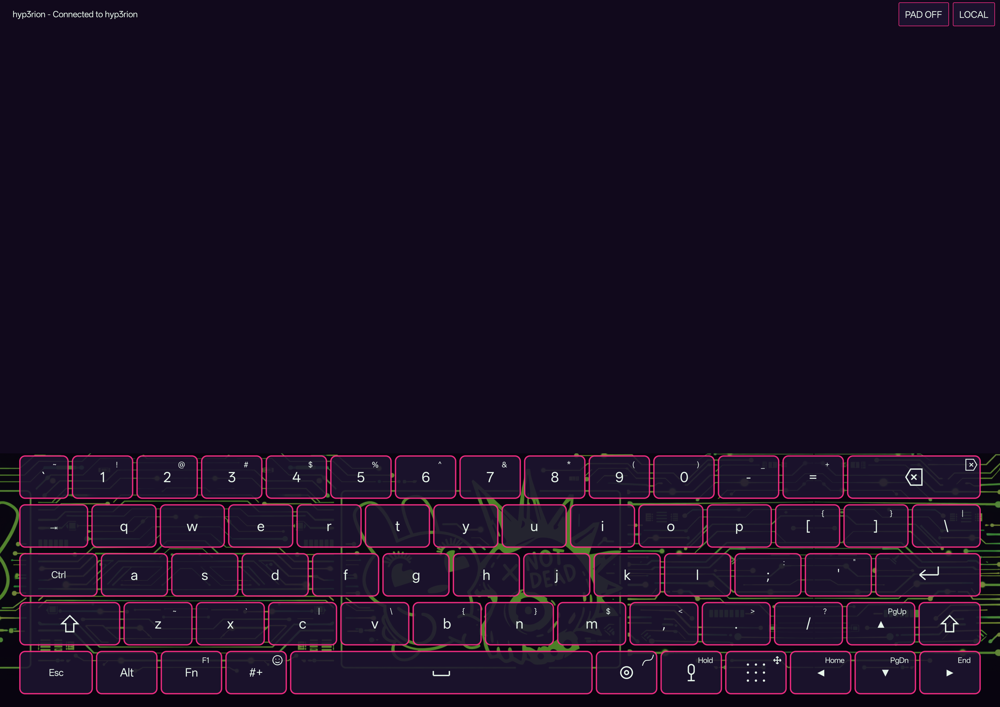
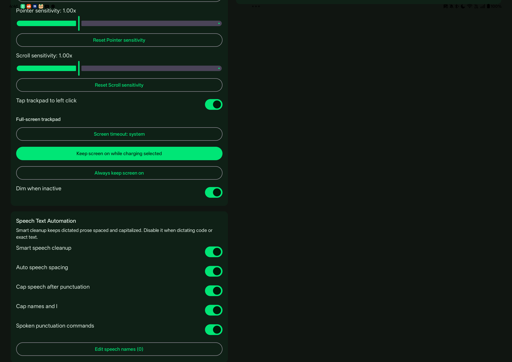

# Bluetooth Remote And Trackpad

1337 Board can act as a Bluetooth HID keyboard and trackpad for a paired desktop, laptop, tablet, or phone. This is intended for tablet workflows where the Android device becomes a privacy-friendly local keyboard, speech input surface, and touchpad for another host.

## Requirements

- Android 9 or newer with Bluetooth HID Device support.
- A paired host that accepts Bluetooth keyboard and pointer input.
- Nearby devices permission on Android 12 and newer.
- Bluetooth remote mode enabled in 1337 Board Settings.

The Settings screen shows a Bluetooth diagnostic block so you can confirm the HID API, permission state, adapter state, bonded devices, registration, active target, and connection status.

## Pair And Assign Hosts

1. Open 1337 Board Settings.
2. In **Bluetooth Remote**, enable **Enable Bluetooth remote mode**.
3. Tap **Pair/manage Bluetooth hosts** and pair the target device in Android Bluetooth settings.
4. Return to 1337 Board Settings and assign a paired device to BT1, BT2, or BT3.
5. Use **Connection target** to select Local Android input or one of the assigned Bluetooth targets.

Only assigned slots appear as Fn-layer Bluetooth keys. Hidden slots are omitted from the keyboard so the Fn layer stays compact.

## Fn Hotkeys

Tap `Fn` to expose the remote target layer. The layer includes `Local`, assigned BT target keys such as `BT1`, and `Pad` for the Bluetooth trackpad toggle. These actions can be rebound from the Action Slots settings.

When a Bluetooth target is active, normal keyboard input, speech-recognized text, and supported special keys are sent to the selected remote host. Use `Local` to return the keyboard to Android input.

From any Android text field, tap `Fn`, then an assigned target such as `BT1` to connect the remote host and raise the trackpad above the keyboard for quick remote input. Tap `Local` to return the same keyboard surface to Android-local input.

## Full-Screen Trackpad

The full-screen trackpad keeps the configured portrait or landscape keyboard height and fills the remaining screen with the touchpad surface. The header shows connection status plus quick controls:

- **KB ON / KB OFF** hides or restores the keyboard surface. When hidden, the touchpad fills the content area below the header.
- **PAD ON / PAD OFF** toggles the touchpad surface while keeping the keyboard available.
- **LOCAL** switches back to Android-local input.
- The window follows the current app theme, including dark mode.

## Macro Side Keys

Full-screen trackpad mode can show optional macro key stacks on the left side, right side, or both sides of the touchpad. These are meant for repeated remote-host actions such as copy/paste, terminal navigation, function keys, and common app shortcuts.

Configure them in **1337 Board Settings > Bluetooth Remote > Trackpad macro side keys**:

1. Choose **Off**, **Left**, **Right**, or **Both**.
2. For each visible side, fill a **Button label** such as `Copy`, `F1`, or `PgDn`.
3. Fill **Macro actions** with one step per line or comma-separated steps.
4. Leave either field blank to hide that slot.

Macro actions support single keys, modifier combos, text insertion, and multi-step sequences:

- `f1` sends `F1`.
- `shift+tab` sends one `Shift+Tab` combo.
- `f3, shift+tab` sends `F3`, then `Shift+Tab`.
- `ctrl+c, ctrl+v` sends copy, then paste.
- `text:git status, enter` types `git status`, then presses Enter.

Supported modifiers are `ctrl`, `control`, `alt`, `shift`, and `fn`. Supported named keys include `f1` through `f12`, `esc`, `tab`, `enter`, `space`, `backspace`, `del`, arrows, `home`, `end`, `pgup`, `pgdn`, and `ins`. Each step can combine modifiers with one non-modifier key; use commas or new lines for longer sequences.

## Trackpad Settings

The Bluetooth Remote settings include:

- **Show trackpad when connected** to show or hide the touchpad surface.
- **Trackpad placement** above or below the keyboard.
- **Trackpad height**, pointer sensitivity, scroll sensitivity, and optional two-finger scroll inversion.
- **Tap trackpad to left click** and **Show dedicated mouse buttons**. When dedicated buttons are hidden, one-finger tap sends left click, two-finger tap sends right click, and double-tap can hold left click for drag actions.
- **Double-tap drag window** to tune how quickly the second tap must arrive before drag hold activates.
- **Full-screen trackpad** screen-timeout modes: system timeout, keep on while charging, or always keep on.
- **Dim when inactive** for long remote-control sessions.
- **Trackpad macro side keys** to place custom macro stacks around the touchpad.

## Home-Screen Shortcuts

For each assigned BT slot, tap **Add BT1 trackpad shortcut**, **Add BT2 trackpad shortcut**, or **Add BT3 trackpad shortcut**. Android will ask the launcher to pin a shortcut such as `BT1 Pad`. The shortcut opens the full-screen trackpad directly for that target.

Launcher support varies. If the launcher rejects pinned shortcuts, open 1337 Board normally and use the Fn Bluetooth target keys instead.

## Troubleshooting

- If BT keys do not appear, assign at least one paired host to BT1-BT3 and make sure the slot is not hidden.
- If a host does not receive input, reconnect it from Android Bluetooth settings, then select the target again in 1337 Board Settings.
- If the full-screen trackpad sleeps too quickly, choose **Keep screen on while charging** or **Always keep screen on**.
- If pointer movement feels off, tune pointer sensitivity and scroll sensitivity separately.
- If Android-local input is stuck off, tap `Fn`, then `Local`, or use the **LOCAL** button in full-screen trackpad mode.
